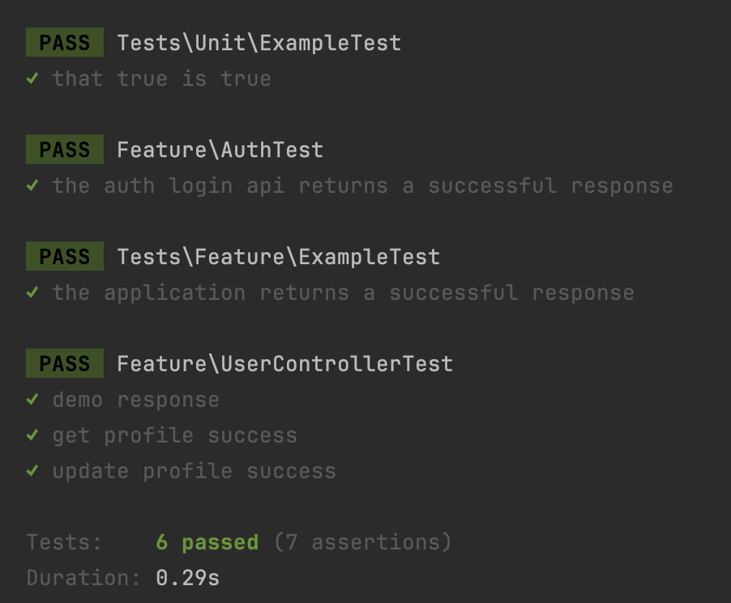

### Code base cho Laravel rest

[Contact email](mailto:ironhoang@gmail.com)

Kế thừa từ https://github.com/sMmominur/restapi-laravel.git

# Tài liệu cho dự án

## Công nghệ sử dụng

- **Language**: PHP 8.2
- **Framework**: Laravel 11
- **Database**: SQLite

---

## Preparation

- Install **PHP 8.2**  
  Link PHP 8.2:
  ```bash
  brew link php@8.2
  ```
- Đảm bảo Composer đã được cài đặt.
- Cần config AWS key để cho vệc upload S3.

## Khởi động nào

1. Clone code

```bash
   git@github.com:ironhoang/laravel_rest_code_base.git
 ```

2. Tạo file .env

```bash
cp -r .env.example .env
```

Cập nhật .env file với AWS keys, region, và bucket information.

3. Khởi tạo JWT Key

```bash
php artisan jwt:secret
```

4. Khởi tạo Application Key

```
php artisan key:generate
```

5. Migrate Database

```
php artisan migrate
```

6. Seed the Database
   Chú ý: Khởi tạo DB sẽ tạo ra dữ liệu mặc định

```
{"email":"test@example.com","password":"Testtest"}
{"email":"admin@example.com","password":"TestAdmin"}
```

```
php artisan db:seed
```

### Unittest

```
php artisan test
```



## [APIs](documents/rest_code_base.postman_collection.json)

### Public APIs (No Login Required)

* Register

```
POST: api/auth/register
```

* Login

```
POST: api/auth/login
```

* Fetch Public Posts

```
GET: api/v1/public_posts
```

### User APIs

#### Fetch Profile Information

```
GET: api/v1/profile
```

#### Update Profile Information

```
PUT: api/v1/profile
```

Use the API to fetch posts:

```
GET: api/v1/public_posts
```

## Admin APIs

### Categories CRUD

```
api/v1/categories
```

### Posts CRUD

```
api/v1/posts
```
